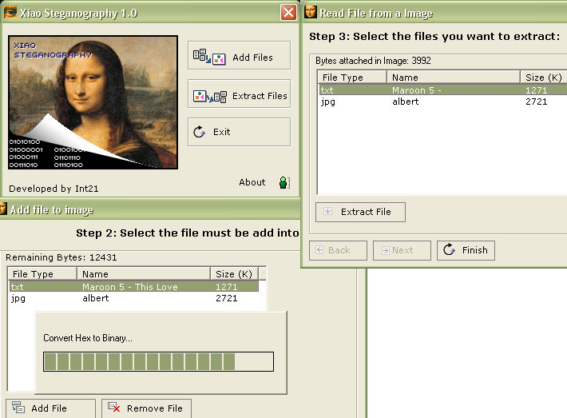



## Xiao Steganography v1\.0\(The real one\)

### Description

Steganography, is the art of covered or hidden writing. The purpose of steganography is covert communication to hide a message from a third party. This differs from cryptography, the art of secret writing, which is intended to make a message unreadable by a third party but does not hide the existence of the secret communication.

Source: www.fbi.gov

So, this proyect can do this.

I was working for 2 week, very hard(fulltime) to finish it.

This 1st version only can work with bmp files(I going to try add support to more files), and you can "attach" only file type plaintext(.txt) or image type(.gif,.jpg,.bmp,.png) im working to add .exe and other types.

To end my note, i just wants to say, keep my credits, and if you like my code, you know what to do, VOTE, VOTE, VOTE and VOTE !!

=) have i nice day
 
### More Info
 

             |
---                |---
**Submitted On**   |2005-06-22 17:00:24
**By**             |[Int\_21](https://github.com/Planet-Source-Code/PSCIndex/blob/master/ByAuthor/int-21.md)
**Level**          |Advanced
**User Rating**    |4.9 (103 globes from 21 users)
**Compatibility**  |VB 5\.0, VB 6\.0
**Category**       |[Encryption](https://github.com/Planet-Source-Code/PSCIndex/blob/master/ByCategory/encryption__1-48.md)
**World**          |[Visual Basic](https://github.com/Planet-Source-Code/PSCIndex/blob/master/ByWorld/visual-basic.md)
**Archive File**   |[Xiao\_Stega1904516222005\.zip](https://github.com/Planet-Source-Code/int-21-xiao-steganography-v1-0-the-real-one__1-61292/archive/master.zip)

